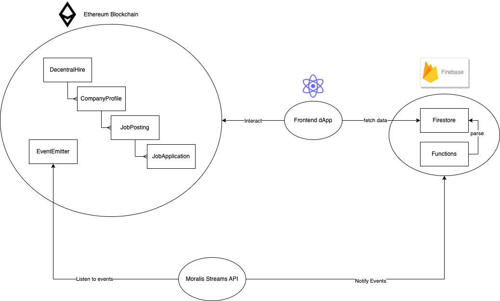

# DecentralHire

This is a blockchain project that makes the hiring process more transparent.

To access the website: https://decentral-hire-web.vercel.app/

***The project is running on Sepolia testnet and the data is subjected to removal or unaccessbile at any time.***

### Structure



- Ethereum blockchain
- Moralis streams API
- Firebase firestore for indexing
- Next.js dApp

Other repositories:
- [Frontend dApp](https://github.com/Eric1015/decentral-hire-web)
- [Firebase functions](https://github.com/Eric1015/decentral-hire-firebase-functions)

### Commands

```shell
# running the test
npx hardhat test

# deploy the contract
npx hardhat run scripts/deploy.ts
```

For local testing:

```shell
# start the local network
npx hardhat node --network hardhat

# copy one of the private key listed in the accounts and import the account in Metamask for test usage.

# deploy the contract to local network
npx hardhat run scripts/deploy.ts --network hardhat
```

For deploying to Sepolia testnet:

```shell
npx hardhat run scripts/deploy.ts --network sepolia
```


### Test Code generation with ChatGPT

```shell
# input the following prompt command to ChatGPT for it to generate the test code for you:

Can you write the hardhat test code for the following solidity smart contract by leveraging loadFixture function from the library "@nomicfoundation/hardhat-network-helpers"?

<Contract file content here>
```


```shell
npx hardhat help
npx hardhat test
REPORT_GAS=true npx hardhat test
npx hardhat node
npx hardhat run scripts/deploy.ts
```
